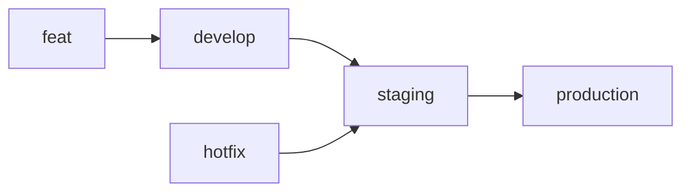

# Onboarding flow

자신의 폴더를 생성 후 폴더안에 wednesday.txt 파일 생성 후 develop 브랜치에 merge하기 

- 이슈제목 : onboarding flow practice
- 브랜치 생성 전략 따라서 생성
- commit convention 따라 작성
- PR 등록 후 리뷰어 팀원 모두!
- 팀원 모두 승인 시 merge

### Overview

저희 스터디는 매일 수업 시간에 배운 내용을 정리하고 이를 기록하는 스터디입니다. 기록은 Github의 repository(https://github.com/teamStudy1/study) 를 사용합니다.

### Rule

- 폴더 생성은 아래와 같이 구성해주세요

```markdown
📁
- 1week
  ㄴ gildong
     - monday
     - tuesday
  ㄴ nayong
     - monday
     - tuesday
- 2week
- 3week
- 4week
```

- 매주 develop으로 부터 feature 브랜치를 생성합니다. feature 브랜치의 이름은 `feat/[이름]-[주차]-[요일]` 로 정합니다

<aside>
💡

예를 들어 hongildong의 1주차 월요일 학습을 기록하는 경우 `feat/gildong-1week-mon` 브랜치를 생성합니다.

</aside>

- 배운 내용을 정리할 때는 마크다운 문법을 사용합니다
- 기록이 끝나면 feature 브랜치의 PR을 요청합니다
- 스터디 구성원이 모두 PR을 확인하고 승인하면 develop 브랜치에 merge합니다
- 한 주차 스터디가 끝나면 `staging` 에 변경사항을 모두 반영합니다

# 🐙 Git Convention

### git flow



- 작업 사항이 있는 경우 `develop` 브랜치로 부터 feature 브랜치를 생성합니다
- `hotfix` 는 `develop` 브랜치가 아닌 `staging` 에 바로 반영합니다
- 1주 단위로 `develop` 을 `staging` 브랜치에 반영합니다
- 한 달의 스터디가 끝나면 `staging` 을 `production`에 반영합니다

### commit convention

`type`

- **Feat** : 새로운 기능을 추가. 기존의 기능을 요구사항에 맞게 수정
- **Fix** : 버그 수정
- **Docs** : 문서 수정
- **typo** : 코드 수정 없이 코드의 스타일 변경, 세미콜론 누락 등 코드 스타일에 대한 커밋.
- **Refactor** : 기능 추가가 아닌 코드의 리펙토링
- **Test** : 테스트 코드 추가, 수정.
- **Chore** : 빌드 관련 수정, 패키지 매니저 수정 등 그 외 자잘한 수정 (ex: .gitignore)
- **Rename** : 파일명, 폴더명 수정이나 파일, 폴더의 이동
- **Remove** : 코드(파일) 의 삭제

`commit message`

```markdown
feat/[이슈번호]: 커밋메세지 제목 

커밋메세지

내용
```

### PR Convention

```markdown
제목 : [커밋 메세지]
close #[이슈번호]

## 코드설명

## 궁금한것
```

- 리뷰어에 스터디 팀원을 모두 등록합니다
- 모든 리뷰어가 approve 하면 변경사항을 merge 합니다
